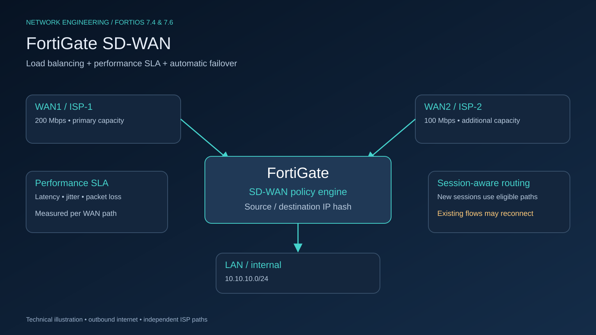
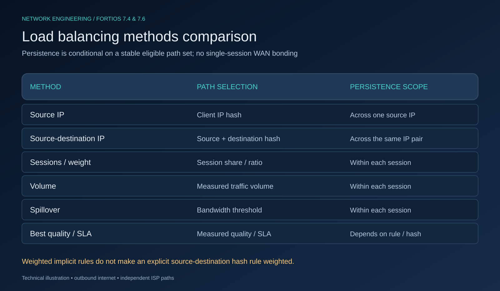
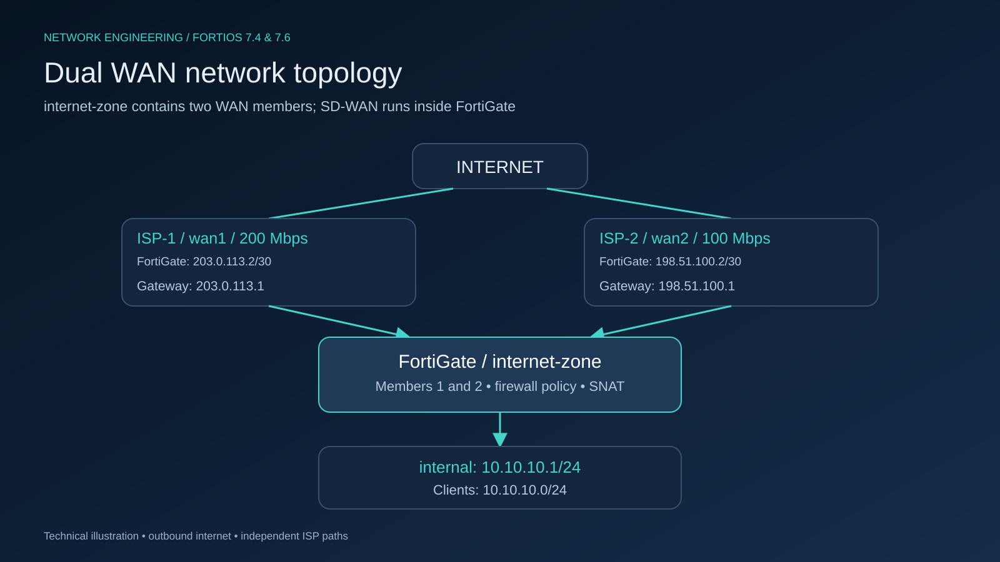
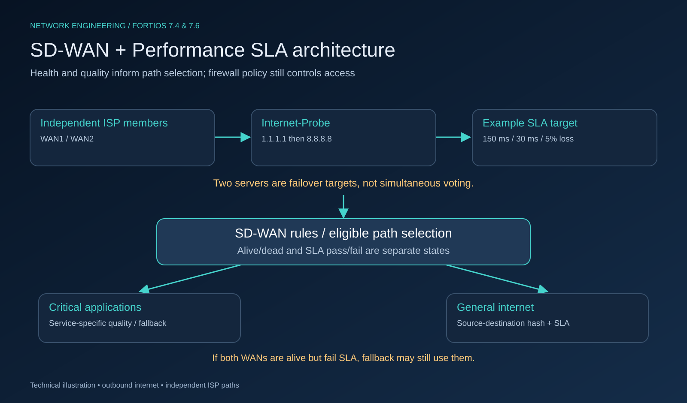
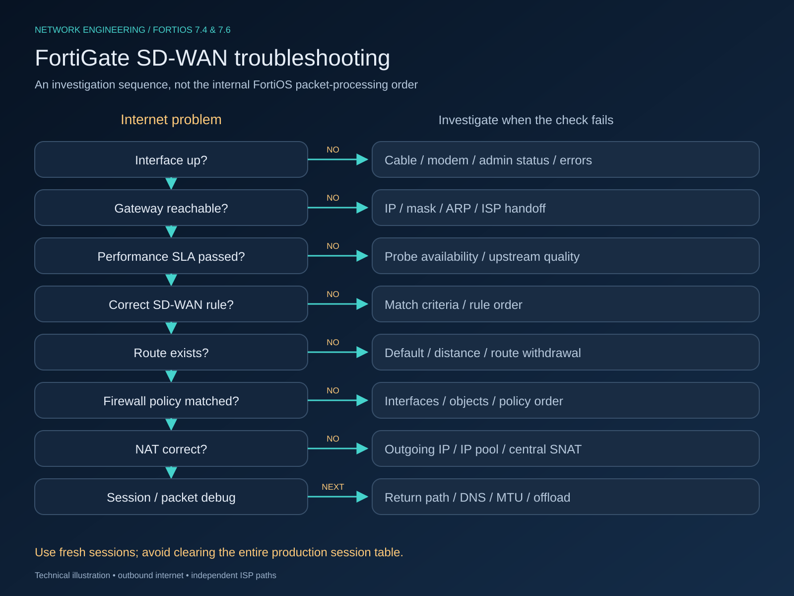

# راه‌اندازی Load Balancing و Failover اینترنت در FortiGate با SD-WAN و Performance SLA

**مخاطب:** مدیران شبکه، Network Engineerها و System Administratorها؛ سطح Intermediate تا Advanced.

**نسخه مرجع تنظیمات:** FortiOS 7.6.3؛ Syntax اصلی با CLI Reference نسخه 7.4.6 نیز تطبیق داده شده است. این مقاله نمونه طراحی و Runbook است؛ تأیید مستندات جای اجرای آزمون پذیرش روی مدل و Patch واقعی دستگاه را نمی‌گیرد.



*تصویر ۱ — استفاده همزمان از دو ISP همراه با پایش کیفیت و Failover برای اتصال اینترنت سازمان.*

## مقدمه

داشتن دو اینترنت زمانی به دسترس‌پذیری بالاتر منجر می‌شود که فایروال بتواند تفاوت «پورت روشن»، «Gateway پاسخ‌گو» و «مسیر اینترنت قابل استفاده» را تشخیص دهد. ممکن است Gateway اپراتور Ping شود، اما مسیر بالادست دچار Packet Loss باشد یا تأخیر آن تماس‌های صوتی را مختل کند.

دو Static Route با Distance متفاوت معمولاً مسیر اصلی و پشتیبان می‌سازند؛ مسیر با Distance کمتر ترجیح داده می‌شود. این تنظیم به‌تنهایی Load Balancing یا تشخیص افت کیفیت ایجاد نمی‌کند. ECMP ساده نیز چند مسیر هم‌هزینه را در اختیار Routing قرار می‌دهد، اما به‌تنهایی سیاست مستقلی برای کیفیت Microsoft 365، تماس صوتی و دانلود بزرگ ندارد. می‌توان به Routing سنتی Link Monitor اضافه کرد؛ محدودیت مورد بحث، ECMP یا Static Route **بدون لایه پایش و سیاست سرویس** است.

معماری عملیاتی این راهنما چنین است:

**FortiGate → SD-WAN → Multiple ISP → Performance SLA → Traffic Steering → Source-Destination Load Balancing → Automatic Failover**

SD-WAN انتخاب مسیر را به نوع ترافیک و کیفیت لینک مرتبط می‌کند. Firewall Policy همچنان مسئول اجازه عبور ترافیک است و NAT و Routing نیز باید درست باشند؛ SD-WAN جای این اجزا را نمی‌گیرد. [مستند رسمی SD-WAN Rules](https://docs.fortinet.com/document/fortigate/7.4.6/administration-guide/716691/sd-wan-rules)

## Load Balancing در FortiGate چیست؟

در این سناریو Load Balancing یعنی تقسیم اتصال‌ها یا گروه‌های اتصال بین چند WAN. برای مثال، بخشی از کاربران از WAN1 به اینترنت می‌روند و بخشی از WAN2. FortiGate یک Session را با اطلاعاتی مانند آدرس‌ها، پورت‌ها و پروتکل دنبال می‌کند؛ مسیر انتخاب‌شده و ترجمه NAT بخشی از وضعیت آن هستند.

این طراحی، Bonding دو ISP نیست. یک TCP Session معمولی بین دو WAN تقسیم نمی‌شود و سرعت آن به مجموع ۲۰۰ و ۱۰۰ مگابیت نمی‌رسد. تعداد زیادی اتصال مستقل می‌توانند از ظرفیت هر دو اینترنت استفاده کنند. سرعت واقعی به ظرفیت WAN انتخاب‌شده، سرور مقصد، RTT، ازدحام، توان پردازشی FortiGate و Security Inspection بستگی دارد.

یک Download Manager که چند اتصال TCP مستقل ایجاد می‌کند ممکن است در بعضی الگوریتم‌ها از هر دو WAN استفاده کند؛ با Source-Destination IP Based، اتصال‌های دارای همان زوج IP معمولاً به یک WAN می‌روند. بنابراین حتی دانلود چنداتصالی نیز الزاماً دو لینک را همزمان مصرف نمی‌کند.

## تفاوت Load Balancing و Failover

| مفهوم | هدف | رفتار نمونه |
|---|---|---|
| Load Balancing | استفاده از چند مسیر برای توزیع بار | اتصال‌های جدید بین WAN1 و WAN2 پخش می‌شوند |
| Failover | ادامه سرویس پس از خرابی یا نامناسب شدن مسیر | اتصال‌های جدید از لینک جایگزین عبور می‌کنند |

Load Balancing بدون Health Check مناسب ممکن است اتصال‌های جدید را به یک اینترنت معیوب بفرستد. Failover نیز ممکن است بدون استفاده همزمان از دو لینک اجرا شود. در معماری پیشنهادی، توزیع بار و حذف مسیر نامناسب با هم کار می‌کنند، ولی دو تصمیم مستقل هستند.

### Active/Active و Active/Passive

در این مقاله این اصطلاح‌ها درباره **لینک‌های اینترنت** هستند و نباید با حالت HA Cluster در FortiGate اشتباه گرفته شوند.

**Active/Active:** هر دو WAN برای بخشی از ترافیک استفاده می‌شوند. برای سازمانی مناسب است که ظرفیت هر دو ISP را نیاز دارد و برنامه‌های آن تغییر IP خروجی بین اتصال‌های مستقل را تحمل می‌کنند. ترافیک حساس همچنان می‌تواند Rule اختصاصی داشته باشد.

**Active/Passive:** WAN1 مسیر اصلی و WAN2 پشتیبان است. وقتی WAN2 هزینه حجمی دارد، ظرفیت آن پایین است یا برنامه تجاری به IP خروجی ثابت حساس است، این مدل قابل پیش‌بینی‌تر است. برای Failover مبتنی بر کیفیت از Rule نوع SLA با Load Balancing غیرفعال و اولویت/Cost مناسب استفاده کنید؛ صرف Distance متفاوت تضمین تشخیص Brownout نیست.

در هر دو مدل، لینک باقی‌مانده باید ظرفیت ترافیک ضروری سازمان را داشته باشد. اگر مصرف معمول ۱۸۰ Mbps باشد، WAN2 با ظرفیت ۱۰۰ Mbps نمی‌تواند هنگام قطعی همه بار را با همان کیفیت حمل کند؛ QoS و محدود کردن Backup در زمان خرابی بخشی از طراحی است.

## روش‌های Load Balancing

FortiOS بین الگوریتم **Implicit Rule** و Strategy/Hash در **Explicit SD-WAN Service Rule** تفاوت می‌گذارد. گزینه‌های این دو سطح یکسان نیستند. Session Based و Weight Based در Implicit Rule دو الگوریتم مستقل نیستند: گزینه GUI با نام Sessions از `weight-based` استفاده می‌کند. [Selecting the implicit SD-WAN algorithm](https://docs.fortinet.com/document/fortigate/7.4.1/administration-guide/683285/selecting-the-implicit-sd-wan-algorithm)

### Source IP Based

Hash بر اساس IP مبدأ ساخته می‌شود. اتصال‌های یک Client به مقصدهای مختلف به همان مسیر نگاشت می‌شوند، تا زمانی که مجموعه لینک‌ها و وضعیت انتخاب مسیر تغییر نکرده باشد.

- **مزیت:** ثبات بیشتر IP خروجی برای هر Client و رفتار ساده برای برنامه‌های حساس به تغییر IP.
- **عیب:** یک Client پرمصرف یا Proxy با تعداد زیادی کاربر پشت یک IP می‌تواند یک WAN را اشباع کند.
- **کاربرد:** شبکه‌ای با Clientهای متعدد و بار نسبتاً مشابه؛ سرویس‌هایی که ثبات خروجی در سطح کاربر مهم است.
- **Persistence:** در سطح Source IP؛ تضمین دائمی بعد از Failover یا تغییر توپولوژی نیست.
- **Enterprise:** قابل استفاده است، ولی برای Proxy، NAT داخلی و تعداد کم Source با بار نامتوازن باید ارزیابی شود.

### Source-Destination IP Based

Hash از زوج IP مبدأ و مقصد ساخته می‌شود. یک Client می‌تواند برای مقصدهای مختلف به WANهای متفاوت نگاشت شود، در حالی که اتصال‌های آن به یک IP مشخص مسیر یکسانی داشته باشند.

- **مزیت:** تعادل مناسب بین توزیع بار و ثبات زوج مبدأ/مقصد.
- **عیب:** Hash ظرفیت واقعی، حجم هر Session یا حساسیت برنامه را به‌تنهایی نمی‌فهمد؛ چند Flow بزرگ می‌توانند نتیجه نامتوازن ایجاد کنند.
- **کاربرد:** General Internet در کنار SLA و Ruleهای اختصاصی برنامه‌ها.
- **Persistence:** در سطح زوج IP؛ با تغییر لینک‌های واجد شرایط ممکن است نگاشت تغییر کند.
- **Enterprise:** گزینه مناسب برای ترافیک عمومی، با استثناهای صریح برای برنامه‌های حساس.

### Session Based

تصمیم توزیع در سطح Sessionهای جدید گرفته می‌شود. در Implicit Rule، تعداد Sessionها و وزن اعضا مبنای تقسیم است؛ در Explicit Rule، `round-robin` گزینه دیگری برای توزیع نوبتی اتصال‌های جدید است. این دو رفتار را نباید دقیقاً یکسان دانست.

- **مزیت:** تعداد زیادی اتصال یک Source به یک Destination هم می‌تواند بین WANها توزیع شود.
- **عیب:** Sessionهای یک برنامه ممکن است IP عمومی متفاوت داشته باشند؛ یک Session کوتاه و یک دانلود سنگین از نظر شمارش اتصال هم‌ارز نیستند.
- **کاربرد:** Clientهای کم با اتصال‌های مستقل فراوان و برنامه‌هایی که چند IP خروجی را تحمل می‌کنند.
- **Persistence:** مسیر یک Session حفظ می‌شود، اما اتصال بعدی همان برنامه ممکن است مسیر دیگری بگیرد.
- **Enterprise:** برای ترافیک منتخب مناسب است؛ برای بانکداری، SSO و سرویس‌های مبتنی بر IP Whitelist باید آزمایش شود.

### Weight Based

در Implicit Rule، وزن اعضا سهم تقریبی تعداد Sessionها را تعیین می‌کند. وزن ۲ و ۱ به معنی سهم آماری نزدیک به دوسوم و یک‌سوم است؛ سهم پهنای باند تضمین نمی‌شود.

- **مزیت:** تطبیق تقریبی توزیع اتصال با لینک‌های نامساوی.
- **عیب:** اندازه Sessionها متفاوت است؛ نسبت تعداد اتصال الزاماً نسبت Mbps نیست.
- **کاربرد:** لینک‌های با ظرفیت متفاوت و تعداد زیاد Session مستقل.
- **Persistence:** مانند Session Based؛ ثبات زوج Source/Destination الزام عمومی آن نیست.
- **Enterprise:** معتبر، مشروط به تفکیک از Hash در Rule صریح و سنجش بار واقعی.

### Volume Based

هدف توزیع، سهم حجم ترافیک اندازه‌گیری‌شده است. در Implicit Rule از `measured-volume-based` و `volume-ratio` استفاده می‌شود.

- **مزیت:** نسبت به شمارش Session به میزان داده حساس‌تر است.
- **عیب:** اندازه‌گیری حجم گذشته، ظرفیت لحظه‌ای یا کیفیت برنامه را تضمین نمی‌کند؛ Flow طولانی از قبل انتخاب‌شده را به دو WAN تبدیل نمی‌کند.
- **کاربرد:** ترافیک حجیم و نسبت ظرفیت نامساوی، پس از سنجش رفتار مدل دستگاه و Offload.
- **Persistence:** Session معمولاً روی مسیر انتخاب‌شده ادامه می‌یابد؛ انتخاب Sessionهای بعدی می‌تواند تغییر کند.
- **Enterprise:** با Monitoring و آزمون واقعی قابل استفاده است، نه به‌عنوان جایگزین SLA.

### Spillover

لینک اول تا رسیدن به آستانه مصرف استفاده می‌شود؛ Sessionهای اضافی به لینک بعدی می‌روند. گزینه Implicit CLI آن `usage-based` است.

- **مزیت:** استفاده ترجیحی از اینترنت ارزان‌تر و مصرف WAN دوم هنگام افزایش بار.
- **عیب:** نیاز به آستانه صحیح و لحاظ کردن محدودیت سخت‌افزار/Offload دارد؛ پخش برابر ایجاد نمی‌کند.
- **کاربرد:** ISP اصلی با هزینه ثابت و ISP دوم با هزینه حجمی.
- **Persistence:** Sessionهای موجود معمولاً به‌خاطر عبور از آستانه به مسیر جدید منتقل نمی‌شوند.
- **Enterprise:** در سناریوی هزینه‌محور مفید است؛ توصیه عمومی برای تمام شبکه‌ها نیست.

Fortinet در مثال Spillover نسخه 7.4.1 غیرفعال کردن `auto-asic-offload` در Policy را لازم دانسته است؛ هزینه پردازشی آن باید پیش از استفاده سنجیده شود. [Implicit rule](https://docs.fortinet.com/document/fortigate/7.4.1/administration-guide/216765/implicit-rule)

### Best Quality / SLA Based

Best Quality مسیر را با معیار منتخب، مانند Latency یا Jitter، رتبه‌بندی می‌کند. Lowest Cost (SLA) ابتدا لینک‌های مطابق SLA را ترجیح می‌دهد و در حالت عادی از Cost و Preference برای انتخاب استفاده می‌کند. فعال کردن Load Balancing در حالت SLA، لینک‌های واجد SLA را برای توزیع بار انتخاب می‌کند؛ در این حالت Cost نقش وزن توزیع ندارد.

- **مزیت:** واکنش به Brownout و کیفیت واقعی مسیر، حتی وقتی پورت Up است.
- **عیب:** نتیجه به Target، پروتکل Probe، Threshold و سیاست Fallback وابسته است.
- **کاربرد:** VoIP، برنامه تجاری، VPN و General Internet با SLA مناسب.
- **Persistence:** تصمیم برای مسیر اتصال جدید است؛ تضمین جابه‌جایی بی‌وقفه اتصال موجود ایجاد نمی‌کند.
- **Enterprise:** پایه اصلی طراحی پیشنهادی؛ برای هر کلاس سرویس معیار مناسب انتخاب شود.

[Best quality strategy](https://docs.fortinet.com/document/fortigate/7.6.3/administration-guide/22371/best-quality-strategy)، [Load balancing strategy](https://docs.fortinet.com/document/fortigate/7.4.7/administration-guide/708464/load-balancing-strategy)

## مقایسه Algorithmها



*تصویر ۴ — تفاوت معیار انتخاب مسیر با دامنه Persistence؛ کیفیت مسیر لایه‌ای جدا از الگوریتم تقسیم بار است.*

| روش | معیار | مزیت اصلی | محدودیت اصلی | Persistence بین اتصال‌ها | تناسب Enterprise |
|---|---|---|---|---|---|
| Source IP | Hash مبدأ | ثبات خروجی هر Client | تجمع بار Source پرمصرف | بالا در سطح مبدأ | مناسب با ارزیابی بار |
| Source-Destination | Hash زوج IP | تعادل ثبات و توزیع | عدم آگاهی از اندازه Flow | بالا برای همان زوج | مناسب General Internet |
| Session | اتصال جدید/شمار Session | توزیع اتصال‌های متعدد | خروجی متفاوت برای یک برنامه | تضمین زوج IP ندارد | مناسب ترافیک منتخب |
| Weight | نسبت تعداد Session | پشتیبانی از ظرفیت نامساوی | Mbps تضمین نمی‌شود | مانند Session | مناسب با Monitoring |
| Volume | سهم حجم داده | توجه بیشتر به مصرف | واکنش وابسته به اندازه‌گیری | درون Session حفظ می‌شود | نیازمند آزمون |
| Spillover | آستانه مصرف | کنترل هزینه WAN دوم | حساس به Threshold/Offload | درون Session حفظ می‌شود | مناسب هزینه‌محور |
| Best Quality | رتبه کیفیت | بهبود مسیر سرویس حساس | وابستگی به Probe | انتخاب جدید وابسته به کیفیت | مناسب Critical Apps |
| SLA + Load Balance | SLA سپس Hash | کیفیت و توزیع همزمان | نیازمند Fallback روشن | وابسته به Hash منتخب | معماری پایه پیشنهادی |

## چرا Source-Destination برای ترافیک عمومی مناسب است؟

فرض کنید Client برابر `10.10.10.25` و Destination برابر `8.8.8.8` است. FortiGate از این زوج یک Hash می‌سازد و آن را به یکی از اعضای واجد شرایط نگاشت می‌کند. نمی‌توان بدون مشاهده دستگاه گفت نتیجه حتماً WAN1 است؛ فرض می‌کنیم در این مثال WAN1 انتخاب شده است.

```text
10.10.10.25 → 8.8.8.8 → Hash pair A → WAN1
10.10.10.25 → 1.1.1.1 → Hash pair B → WAN1 or WAN2
10.10.10.26 → 8.8.8.8 → Hash pair C → WAN1 or WAN2
```

اتصال‌های همان زوج `10.10.10.25 / 8.8.8.8`، با مجموعه اعضای سالم ثابت و Rule یکسان، به همان WAN نگاشت می‌شوند. تغییر پورت مبدأ به‌تنهایی مبنای این Hash نیست. در Session Based، اتصال جدید همان زوج می‌تواند WAN دیگری بگیرد.

این ویژگی برای شبکه دارای کاربران و مقصدهای متنوع مفید است، اما **Session Persistence یک وب‌سایت را تضمین نمی‌کند**: یک وب‌سایت ممکن است چند IP، CDN و سرویس احراز هویت جدا داشته باشد. Client نیز ممکن است IP دیگری بگیرد. برای برنامه‌ای که به IP خروجی یکسان نیاز دارد، Rule اختصاصی با مسیر ترجیحی و Fallback مشخص مناسب‌تر است.

## چرا SD-WAN؟

Routing معمولی بیشتر می‌پرسد «کدام Route موجود است؟». طراحی SD-WAN می‌تواند بپرسد «برای این Traffic، کدام مسیر موجود کیفیت مناسب‌تری دارد؟». این تفاوت اجازه می‌دهد اینترنت عمومی تقسیم شود، تماس صوتی روی مسیر کم‌Jitter قرار بگیرد و Backup از لینک ارزان‌تر استفاده کند.

SD-WAN یک موتور Policy برای انتخاب WAN است؛ شناسایی برنامه، SLA و Route باید هماهنگ باشند. برای Traffic Steering بر اساس Application Control، تشخیص برنامه ممکن است پس از شروع اتصال کامل شود؛ Port Match به‌تنهایی اثبات شناسایی یک Application نیست. [Dynamic application steering](https://docs.fortinet.com/document/fortigate/7.6.1/administration-guide/80739/dynamic-application-steering-with-lowest-cost-and-best-quality-strategies)

## معماری پیشنهادی

| بخش | Interface | مشخصات | IP مثال FortiGate | Gateway |
|---|---|---|---|---|
| WAN1 | `wan1` | ISP-1؛ 200 Mbps | `203.0.113.2/30` | `203.0.113.1` |
| WAN2 | `wan2` | ISP-2؛ 100 Mbps | `198.51.100.2/30` | `198.51.100.1` |
| LAN | `internal` | `10.10.10.0/24` | `10.10.10.1/24` | Gateway کاربران: `10.10.10.1` |
| SD-WAN Zone | `internet-zone` | شامل WAN1 و WAN2 | ندارد | Gateway هر Member |

آدرس‌های WAN از محدوده‌های مستندسازی TEST-NET هستند و روی اینترنت واقعی Routable نیستند. پیش از اجرا، IP/Mask/Gateway واقعی تخصیص‌یافته توسط ISP را جایگزین کنید. `1.1.1.1` و `8.8.8.8` تنها آدرس‌های عمومی واقعی این مثال هستند و به‌طور عمدی به‌عنوان Probe Target استفاده شده‌اند.

```text
                Internet
            /              \
         ISP-1             ISP-2
       200 Mbps           100 Mbps
          |                  |
        wan1               wan2
            \              /
              FortiGate
          [SD-WAN engine]
                 |
              internal
                 |
           10.10.10.0/24
```

SD-WAN یک لینک فیزیکی بین FortiGate و LAN نیست؛ برچسب آن در دیاگرام نشان‌دهنده موتور منطقی انتخاب مسیر داخل FortiGate است.



*تصویر ۲ — دو WAN مستقل عضو internet-zone هستند؛ کاربران LAN از Gateway داخلی FortiGate استفاده می‌کنند.*

### پیش‌نیازهای اجرایی

سناریوی CLI، IPv4، NAT/Route Mode، یک VDOM به نام `root` و NGFW Profile-based با Central NAT غیرفعال را فرض می‌کند. Interfaceهای `wan1`، `wan2` و `internal` باید واقعاً روی دستگاه وجود داشته باشند. روی برخی مدل‌ها نام LAN متفاوت است یا WANها عضو Switch هستند؛ قبل از Paste، ساختار واقعی را بررسی کنید.

از Configuration نسخه پشتیبان بگیرید، دسترسی Console یا Management مستقل داشته باشید و Route، Policy Route، VIP، DHCP/PPPoE و Policyهای ارجاع‌دهنده به WANها را بررسی کنید. افزودن Interface دارای ارجاع ناسازگار به SD-WAN ممکن است پذیرفته نشود. IDهای ۱ و ۲ اعضا و ۱۰ Rule در نمونه باید آزاد باشند. اجرای `edit` روی ID موجود، همان Object را تغییر می‌دهد.

نمونه برای دو WAN استاتیک است. تبدیل آن به DHCP/PPPoE با Gateway ثابت صحیح نیست؛ Gateway و Default Routeهای خودکار آن مدل باید جداگانه طراحی شوند. DNS کاربران نیز باید از قبل مشخص باشد؛ این راهنما DHCP/DNS Server سازمان را بازتعریف نمی‌کند.

## Performance SLA

Health Check کیفیت مسیر هر WAN تا یک مقصد بیرونی را اندازه می‌گیرد. Performance SLA این اندازه‌گیری را با معیار موردنیاز سرویس مقایسه می‌کند.

| Metric | تعریف عملیاتی | مقدار نمونه |
|---|---|---|
| Latency | تأخیر رفت‌وبرگشت Probe در این طراحی Ping | 150 ms |
| Jitter | نوسان تأخیر نمونه‌ها | 30 ms |
| Packet Loss | درصد Probeهای بی‌پاسخ در پنجره اندازه‌گیری | 5% |

این اعداد **Example** هستند. ۵٪ Loss ممکن است برای تماس صوتی بسیار نامناسب باشد؛ برای یک مسیر بین‌قاره‌ای، ۱۵۰ ms ممکن است حتی در شرایط عادی دست‌نیافتنی باشد. Baseline را برای Location، ساعت اوج، سرویس و هر ISP ثبت کنید؛ سپس Thresholdها را از SLO واقعی استخراج کنید.

### انتخاب Target و جلوگیری از False Positive

برای Health Check عمومی از `1.1.1.1` و `8.8.8.8` استفاده می‌کنیم. این دو مقصد در شبکه‌های مستقل هستند؛ با این حال Ping یک DNS عمومی، عملکرد HTTPS یا Microsoft 365 را اثبات نمی‌کند. Anycast، Rate Limiting و تغییر مسیر مقصد هم بر نتیجه اثر دارند.

در Health Check دارای دو Server، FortiOS ابتدا Server اول را Probe می‌کند؛ اگر unavailable شود، Server دوم استفاده می‌شود. این روش رأی‌گیری همزمان دو مقصد نیست. ممکن است Server اول Reachable ولی کند باشد و باعث SLA Fail شود؛ صرف تعریف Server دوم این حالت را برطرف نمی‌کند. برای Production، علاوه بر این Probe عمومی، Health Checkهای مستقل و مرتبط با سرویس، مثلاً HTTPS به Endpoint تحت کنترل سازمان، طراحی کنید و منطق انتخاب/Fallback هر Rule را مشخص کنید. [Link health monitor](https://docs.fortinet.com/document/fortigate/7.6.4/administration-guide/580649/link-health-monitor)

چند Target در یک Rule را بدون بررسی نحوه ترکیب SLAها، معادل AND، OR یا Majority ندانید. سلامت ISP و سلامت Application دو مسئله متفاوت‌اند؛ اختلال سراسری یک SaaS نباید الزاماً باعث جابه‌جایی مداوم همه اینترنت سازمان شود.

### Alive/Dead با SLA Pass/Fail فرق دارد

**Dead:** Probe پاسخ نمی‌گیرد و مکانیزم شکست Health Check فعال می‌شود. **Alive ولی SLA Failed:** مسیر پاسخ می‌دهد، اما کیفیت به حد تعیین‌شده نمی‌رسد. در حالت دوم ممکن است Default Route همچنان وجود داشته باشد، ولی Rule مسیر دیگر را ترجیح دهد.

اگر WAN1 SLA Fail شود و WAN2 SLA Pass باشد، اتصال‌های جدید Rule عمومی باید از WAN2 بروند. اگر **هر دو لینک Alive ولی خارج از SLA** باشند، این Strategy می‌تواند برای حفظ اتصال از هر دو استفاده کند؛ SLA یک ممنوعیت مطلق عبور ترافیک نیست. اگر سرویس نیازمند Fail-closed است، آن رفتار باید جداگانه طراحی و آزمون شود. [Lowest cost SLA — رفتار همه لینک‌های خارج از SLA](https://docs.fortinet.com/document/fortigate/7.6.4/administration-guide/342836/lowest-cost-sla-strategy)



*تصویر ۳ — ابتدا سلامت و کیفیت لینک‌ها ارزیابی می‌شود؛ سپس Rule سرویس و الگوریتم توزیع، مسیر Session جدید را انتخاب می‌کنند.*

## پیاده‌سازی GUI

مسیر تأییدشده در FortiOS جدید چنین است:

```text
Network → SD-WAN → SD-WAN Zones
Network → SD-WAN → Performance SLAs
Network → SD-WAN → SD-WAN Rules
```

مسیر `Network → Performance SLA` را به‌عنوان منوی مستقل و عمومی نسخه‌های 7.4/7.6 درج نکنید؛ در مستندات بررسی‌شده، **Performance SLAs یک Tab داخل SD-WAN** است. محل بعضی کنترل‌ها با Patch و Feature Visibility تغییر می‌کند. [راهنمای رسمی GUI SLA](https://docs.fortinet.com/document/fortigate/7.6.4/administration-guide/342836/lowest-cost-sla-strategy)

1. در `Network → Interfaces` آدرس‌های WAN و LAN را مطابق جدول تنظیم کنید.
2. در `Network → SD-WAN` یک Zone با نام `internet-zone` بسازید و `wan1` و `wan2` را با Gateway مربوطه عضو کنید.
3. در Tab `Performance SLAs` یک Check با نام `Internet-Probe` بسازید. Protocol را Ping، Serverها را دو مقصد نمونه و Participants را هر دو WAN قرار دهید. SLA Target را با Thresholdهای جدول فعال کنید.
4. در Tab `SD-WAN Rules`، Rule عمومی `General-Internet` را با Source شبکه LAN، Destination برابر all و Strategy برابر `Lowest Cost (SLA)` ایجاد کنید. SLA تعریف‌شده و هر دو Member را انتخاب و Load balancing را فعال کنید.
5. در `Network → Static Routes` یک Default Route با Interface برابر `internet-zone` ایجاد کنید.
6. در `Policy & Objects → Firewall Policy` عبور `internal` به `internet-zone` را با Source شبکه LAN، NAT روی آدرس Interface خروجی و Logging فعال مجاز کنید.
7. **Hash را با CLI تکمیل کنید.** مستندات این Strategy، گزینه GUI توزیع بار را Round-robin معرفی می‌کنند. فعال کردن Load balancing در GUI به‌تنهایی به معنی Source-Destination نیست. دستور `set hash-mode source-dest-ip-based` در Rule صریح مرحله بعد لازم است.

Caption پیشنهادی برای Screenshot واقعی GUI: «FortiOS 7.6 — Performance SLAs در صفحه SD-WAN؛ اندازه‌گیری Latency، Jitter و Packet Loss برای هر دو WAN». این متن تنها زیر Capture واقعی همان نسخه استفاده شود؛ نمودارهای این بسته Screenshot محصول نیستند.

## پیاده‌سازی CLI

### سازگاری نسخه و ترتیب اجرا

کدهای اصلی زیر با Reference نسخه‌های **7.6.3 و 7.4.6** بررسی شده‌اند. از 7.4.1 به بعد برای این سناریو از `set mode sla` همراه `set load-balance enable` استفاده می‌شود؛ نمونه‌های قدیمی با `set mode load-balance` را بدون تبدیل روی نسخه جدید اجرا نکنید. ادعای سازگاری تمام Patchهای خانواده 7.4/7.6 یا اجرای آزمایشگاهی این Configuration مطرح نیست. [تغییر Strategy](https://docs.fortinet.com/document/fortigate/7.4.7/administration-guide/708464/load-balancing-strategy)

بلوک‌های ۱ تا ۶ را به‌ترتیب، در VDOM هدف و پس از رفع ارجاع‌های ناسازگار WAN اجرا کنید. این یک Configuration کامل برای سناریوی تعریف‌شده است؛ کدهای بخش Weighted و Steering، گزینه‌های جایگزین یا توسعه هستند.

### ۱. آدرس Interfaceها

```fortios
config system interface
    edit "wan1"
        set mode static
        set ip 203.0.113.2 255.255.255.252
        set role wan
        set status up
    next
    edit "wan2"
        set mode static
        set ip 198.51.100.2 255.255.255.252
        set role wan
        set status up
    next
    edit "internal"
        set mode static
        set ip 10.10.10.1 255.255.255.0
        set role lan
        set status up
    next
end
```

`config system interface` وارد جدول Interfaceها می‌شود. هر `edit` Interface موجود را انتخاب می‌کند. `mode static` آدرس‌دهی ثابت، `ip` آدرس و Mask، `role` نقش نمایشی/مدیریتی و `status up` فعال بودن Administrative را تعیین می‌کند؛ `status up` اثبات Link فیزیکی یا اینترنت سالم نیست. `next` Object را ذخیره می‌کند و `end` از جدول خارج می‌شود. تنظیمات Management Access عمداً در این بلوک بازتعریف نشده‌اند؛ فقط از شبکه مدیریتی مجاز به دستگاه دسترسی داشته باشید. [CLI Reference رسمی Interface](https://docs.fortinet.com/document/fortigate/7.6.0/cli-reference/317104469/config-system-interface)

### ۲. Address Object شبکه LAN

```fortios
config firewall address
    edit "LAN-10.10.10.0_24"
        set subnet 10.10.10.0 255.255.255.0
    next
end
```

`config firewall address` جدول آدرس‌ها را باز می‌کند؛ `edit` نام Object و `subnet` شبکه قابل Match را تعیین می‌کند. این Object در Rule انتخاب WAN و Firewall Policy استفاده می‌شود. [نمونه رسمی Address Object](https://docs.fortinet.com/document/fortigate/7.6.3/administration-guide/363127/local-in-policies)

### ۳. SD-WAN Zone و Members

```fortios
config system sdwan
    set status enable
    set load-balance-mode source-dest-ip-based
    config zone
        edit "internet-zone"
        next
    end
    config members
        edit 1
            set interface "wan1"
            set zone "internet-zone"
            set gateway 203.0.113.1
        next
        edit 2
            set interface "wan2"
            set zone "internet-zone"
            set gateway 198.51.100.1
        next
    end
end
```

`status enable` قابلیت SD-WAN را فعال می‌کند. `load-balance-mode` در این سطح الگوریتم **Implicit Rule** را تعیین می‌کند؛ جای `hash-mode` در Rule صریح نیست. `config zone` Zone منطقی را می‌سازد. در `config members`، عدد `edit` شناسه Member، `interface` رابط واقعی، `zone` عضویت و `gateway` Next Hop همان ISP است. Gateway روی Member تنظیم شده و نباید یک Gateway مشترک برای دو ISP ساخته شود. [CLI Reference 7.4.6](https://docs.fortinet.com/document/fortigate/7.4.6/cli-reference/838040159/config-system-sdwan)

### ۴. Health Check و SLA Target

```fortios
config system sdwan
    config health-check
        edit "Internet-Probe"
            set server "1.1.1.1" "8.8.8.8"
            set protocol ping
            set members 1 2
            set interval 1000
            set failtime 5
            set recoverytime 10
            set update-static-route enable
            config sla
                edit 1
                    set latency-threshold 150
                    set jitter-threshold 30
                    set packetloss-threshold 5
                next
            end
        next
    end
end
```

`server` دو Target با رفتار Primary/Secondary تعریف می‌کند. `protocol ping` از ICMP استفاده می‌کند و `members 1 2` هر دو WAN را زیر پایش می‌برد. `interval 1000` فاصله ارسال Probe را بر حسب میلی‌ثانیه تعیین می‌کند. `failtime 5` و `recoverytime 10` به‌ترتیب تعداد شکست‌ها و موفقیت‌های متوالی لازم برای تغییر وضعیت سلامت هستند؛ این‌ها Threshold اختصاصی Latency/Jitter نیستند.

`update-static-route enable` به Health Check اجازه اثرگذاری بر Static Route مرتبط هنگام Down شدن می‌دهد؛ صرف عبور Latency از SLA را برابر حذف Route ندانید. در `config sla`، Target شماره ۱ با Latency و Jitter بر حسب ms و Packet Loss بر حسب درصد تعریف می‌شود. عبارت صحیح CLI، `packetloss-threshold` است.

زمان Failover دقیقاً برابر پنج ثانیه نیست؛ Timeout، Server جایگزین، پنجره اندازه‌گیری و وضعیت Link در زمان واقعی اثر دارند. Recovery ده Probe موفق نیز به‌تنهایی تضمین ده ثانیه کیفیت پایدار برای تمام برنامه‌ها نیست. [CLI Reference 7.6.0](https://docs.fortinet.com/document/fortigate/7.6.0/cli-reference/838040159/config-system-sdwan)

### ۵. SD-WAN Service Rule با Source-Destination Hash

```fortios
config system sdwan
    config service
        edit 10
            set name "General-Internet"
            set mode sla
            set src "LAN-10.10.10.0_24"
            set dst "all"
            set load-balance enable
            set hash-mode source-dest-ip-based
            config sla
                edit "Internet-Probe"
                    set id 1
                next
            end
            set priority-members 1 2
        next
    end
end
```

`config service` جدول Ruleهای SD-WAN را باز می‌کند؛ `edit 10` شناسه و `name` نام Rule است. `mode sla` انتخاب مسیر مبتنی بر SLA را فعال می‌کند. `src` شبکه LAN و `dst all` تمام مقصدهای آن را Match می‌کند. `load-balance enable` توزیع بین اعضای واجد شرایط را فعال و `hash-mode` Hash زوج IP را تعیین می‌کند. زیرجدول `sla`، Check به نام `Internet-Probe` و Target شماره ۱ آن را به Rule متصل می‌کند. `priority-members 1 2` اعضای قابل انتخاب را مشخص می‌کند؛ این اعداد وزن ۲:۱ نیستند.

این Rule عمومی را بعد از Ruleهای Critical قرار دهید. شناسه Rule را با ترتیب Match اشتباه نگیرید؛ ترتیب جدول باید جداگانه بررسی شود. [Lowest cost SLA configuration](https://docs.fortinet.com/document/fortigate/7.6.0/administration-guide/342836)، [hash-mode در CLI Reference 7.6.3](https://docs.fortinet.com/document/fortigate/7.6.3/cli-reference/838040159)

### ۶. Default Route، Firewall Policy و NAT

```fortios
config router static
    edit 0
        set dst 0.0.0.0 0.0.0.0
        set sdwan-zone "internet-zone"
        set distance 10
    next
end

config firewall policy
    edit 0
        set name "LAN-to-Internet-SDWAN"
        set srcintf "internal"
        set dstintf "internet-zone"
        set srcaddr "LAN-10.10.10.0_24"
        set dstaddr "all"
        set action accept
        set schedule "always"
        set service "ALL"
        set nat enable
        set logtraffic all
    next
end
```

در این دو جدول، `edit 0` یک Entry با ID تخصیص‌یافته ایجاد می‌کند. Route با `dst 0.0.0.0 0.0.0.0` پیش‌فرض است و `sdwan-zone` آن را به Zone متصل می‌کند؛ Next Hopهای واقعی از Memberها می‌آیند. `distance 10` فاصله Administrative است و وزن توزیع نیست. Default Routeهای قدیمی/خودکار با Distance پایین‌تر، Routeهای اختصاصی و Policy Routeها را بررسی کنید. این بلوک را برای آزمون‌های مکرر دوباره اجرا نکنید، چون Entry جدید می‌سازد. [Static routing CLI](https://docs.fortinet.com/document/fortigate/7.6.0/cli-reference/200835411/config-router-static)

در Policy، `srcintf` و `dstintf` مسیر امنیتی LAN به Zone، `srcaddr` و `dstaddr` محدوده آدرس‌ها، `action accept` مجوز، `schedule always` زمان و `service ALL` سرویس‌های مجاز نمونه را تعیین می‌کنند. `nat enable` از آدرس Interface خروجی برای SNAT استفاده می‌کند و `logtraffic all` ثبت ترافیک پذیرفته‌شده را فعال می‌کند.

این Policy پایه Connectivity است؛ قبل از بهره‌برداری، دسترسی‌های مجاز و Security Profileهای سازمان را روی آن اعمال کنید. برای پاسخ Sessionهای Stateful نیازی به Policy عمومی WAN-to-LAN نیست. [Configuring SD-WAN in the CLI](https://docs.fortinet.com/document/fortigate/7.6.3/administration-guide/256518/configuring-sd-wan-in-the-cli)

**Central NAT:** نمونه بالا Central NAT غیرفعال را فرض می‌کند. اگر فعال باشد، `set nat enable` داخل Policy برای SNAT کافی نیست؛ باید Central SNAT Map منطبق با طراحی موجود داشته باشید. برای تطبیق با این مثال، Central NAT را روی شبکه فعال کورکورانه خاموش نکنید. [Central SNAT](https://docs.fortinet.com/document/fortigate/7.6.3/administration-guide/421028/central-snat)

### آزمون پذیرش Configuration

قبل از تغییر، Session جدید از چند Client به چند Destination بسازید و Member، Rule ID و IP خروجی را ثبت کنید. سپس به‌ترتیب قطع فیزیکی WAN1، اختلال بالادست با Gateway سالم، افت کیفیت و بازگشت لینک را آزمون کنید. آزمون قطع یک Probe Target و آزمون خارج شدن هر دو WAN از SLA را نیز انجام دهید.

معیار پذیرش: هر دو Member در حالت سالم واجد انتخاب باشند؛ با خرابی WAN1 اتصال تازه از WAN2 عبور کند؛ بعد از بازیابی، اتصال‌های جدید طبق Rule توزیع شوند؛ و اختلال یک Target منفرد به‌عنوان قطعی قطعی ISP گزارش نشود. رفتار اتصال‌های موجود، IP خروجی، تماس صوتی و برنامه‌های حساس جداگانه ثبت شود.

## Weighted Load Balancing برای WANهای ۲۰۰ و ۱۰۰ Mbps

نسبت ظرفیت اسمی:

```text
200 : 100 = 2 : 1
WAN1 Weight = 2
WAN2 Weight = 1
```

این نسبت نقطه شروع است. ظرفیت Upload، ظرفیت تضمین‌شده، ازدحام و کیفیت ISP هم باید لحاظ شوند. نسبت Session مساوی با نسبت Bytes نیست؛ حتی توزیع ۲:۱ ممکن است WAN2 را با چند Download بزرگ اشباع کند.

### Syntax معتبر Weighted در Implicit Rule

بلوک زیر **تغییر کامل الگوریتم Implicit Rule** روی Members ساخته‌شده در سناریوی اصلی است؛ نه شبه‌کد و نه Weighted Hash برای Rule شماره ۱۰:

```fortios
config system sdwan
    set load-balance-mode weight-based
    config members
        edit 1
            set weight 2
        next
        edit 2
            set weight 1
        next
    end
end
```

`load-balance-mode weight-based` توزیع Session در Implicit Rule را فعال می‌کند. `weight` سهم نسبی هر Member را تنظیم می‌کند و باید غیرصفر باشد. این Syntax در CLI Reference 7.4.6 و 7.6.3 وجود دارد. **Rule صریح General-Internet همچنان با `hash-mode source-dest-ip-based` کار می‌کند و وزن‌های بالا آن را ۲:۱ نمی‌کنند.** چون General-Internet شبکه LAN را Match می‌کند، این تغییر برای همان ترافیک اثر مورد انتظار Weighted نخواهد داشت. [CLI Reference 7.4.6](https://docs.fortinet.com/document/fortigate/7.4.6/cli-reference/838040159/config-system-sdwan)، [CLI Reference 7.6.3](https://docs.fortinet.com/document/fortigate/7.6.3/cli-reference/838040159)

اگر قرار است LAN از Implicit Weighted استفاده کند، باید پوشش Explicit Rule آن بازطراحی شود؛ در آن صورت دیگر ادعای همان SLA-Aware Source-Destination معماری اصلی صحیح نیست. وزن Implicit را با Rule صریح ترکیب نکنید و نتیجه‌ای که مستند نشده وعده ندهید.

برای لینک نامساوی، انتخاب عملی می‌تواند حفظ Hash عمومی، Steering دانلود/Backup به WAN مناسب و QoS باشد؛ یا استفاده از الگوریتم Available Bandwidth در Explicit Rule، با پذیرش تغییر رفتار Persistence. `inbandwidth`، `outbandwidth` و `bibandwidth` در Reference 7.6.3 وجود دارند؛ ظرفیت Interface را باید صحیح ثبت کنید. برای این تنظیم، مقدار Upload واقعی را به‌جای فرض برابر بودن با Download وارد کنید. [Manual strategy — bandwidth algorithms](https://docs.fortinet.com/document/fortigate/7.6.3/administration-guide/723448/manual-strategy)

## Traffic Steering: SD-WAN فراتر از تقسیم بار

| اولویت پیشنهادی | Traffic | Strategy | نکته عملیاتی |
|---|---|---|---|
| ۱ | VoIP | Best Quality؛ Jitter یا پروفایل ترکیبی مناسب | معیار واقعی Media Provider و QoS اهمیت دارد |
| ۲ | Microsoft 365 / Business Apps | SLA یا Best Quality | Probe متناسب با سرویس و شناسایی معتبر Application/ISDB |
| ۳ | Backup / Large Downloads | لینک Secondary یا ارزان‌تر با Fallback | زمان‌بندی و Shaping برای حفاظت از سرویس‌های حساس |
| آخر | General Internet | SLA + Source-Destination Hash | Rule عمومی پس از استثناها |

Best Quality با معیار `latency` لزوماً همزمان کمترین Jitter را انتخاب نمی‌کند. می‌توان Jitter را معیار اصلی کرد یا Custom Profile طراحی کرد؛ جمله «بهترین Latency/Jitter» بدون تعریف معیار عملیاتی کافی نیست. همچنین SLA عمومی دو DNS، SLA واقعی Microsoft 365 محسوب نمی‌شود.

### نمونه اجرایی Steering یک Voice Host

برای نمونه، `10.10.10.50` یک Voice Gateway اختصاصی است و قرار است تمام ترافیک آن بر اساس Jitter هدایت شود. Policy موجود LAN-to-Zone آن را پوشش می‌دهد. این مثال Address-based است و ادعای تشخیص خودکار تمام VoIPهای LAN ندارد.

```fortios
config firewall address
    edit "Voice-Gateway"
        set subnet 10.10.10.50 255.255.255.255
    next
end

config system sdwan
    config service
        edit 5
            set name "Voice-Best-Jitter"
            set mode priority
            set src "Voice-Gateway"
            set dst "all"
            set health-check "Internet-Probe"
            set link-cost-factor jitter
            set link-cost-threshold 10
            set priority-members 1 2
        next
        move 5 before 10
    end
end
```

Address Object، Host صوتی را Match می‌کند. `mode priority` حالت Best Quality، `health-check` مرجع اندازه‌گیری، `link-cost-factor jitter` معیار رتبه‌بندی و `link-cost-threshold 10` آستانه درصدی تغییر برتری مسیر را تعیین می‌کنند. `priority-members` اعضای قابل مقایسه‌اند. `move 5 before 10` Rule خاص را پیش از Rule عمومی قرار می‌دهد. برای Production، Check اختصاصی مسیر Provider صوتی را جایگزین Probe عمومی کنید؛ این مثال فقط مکانیزم Steering را نشان می‌دهد. [Best Quality CLI](https://docs.fortinet.com/document/fortigate/7.6.3/administration-guide/22371/best-quality-strategy)

## Failover Scenario و رفتار Sessionها

```text
WAN1 alive + SLA pass; WAN2 alive + SLA pass
        → New sessions distributed by source/destination hash

WAN1 dead OR SLA fail; WAN2 alive + SLA pass
        → New sessions use WAN2

WAN1 recovered + SLA pass
        → New sessions follow the configured SD-WAN rule again
```

در Active/Active، عبارت «WAN1 سالم → ترافیک عادی» به معنی عبور تمام ترافیک از WAN1 نیست؛ WAN2 نیز از ابتدا مشارکت دارد. پس از بازیابی WAN1 هم همه اتصال‌ها به WAN1 برنمی‌گردند، بلکه مجموعه مسیرهای واجد شرایط دوباره در تصمیم Rule شرکت می‌کند.

### New Sessions

اتصال تازه بعد از تغییر وضعیت، بر اساس Rule و اعضای قابل استفاده انتخاب مسیر می‌شود. در Rule اصلی، WAN1 نامناسب و WAN2 سالم یعنی انتخاب WAN2 برای Session جدید. تغییر Rule، Route، SLA و Hash را با Sessionهای **جدید** آزمایش کنید؛ باز کردن مجدد یک صفحه ممکن است هنوز از TCP/HTTP2/QUIC Session قبلی استفاده کند.

### Existing Sessions

Session موجود دارای مسیر، وضعیت TCP/UDP و NAT است. هنگام Brownout ممکن است روی مسیر قبلی باقی بماند؛ هنگام Down شدن یا تغییر Route ممکن است Re-evaluation یا قطع اتصال اتفاق بیفتد. رفتار دقیق به Route Change، تنظیمات Session، SNAT، نوع پروتکل و Patch وابسته است.

در اینترنت Dual ISP، SNAT روی WAN1 مثلاً `203.0.113.2` است؛ روی WAN2 `198.51.100.2` خواهد بود. سرور مقصد نمی‌تواند یک TCP Connection معمولی را با تغییر IP مبدأ عمومی، همان اتصال قبلی فرض کند. دانلود می‌تواند Retry/Resume بخواهد، تماس صوتی قطع شود و VPN نیاز به برقراری مجدد داشته باشد. انتقال بدون اختلال همه Sessionها وعده درستی نیست.

تنظیماتی مانند `snat-route-change` رفتار بازبینی مسیر SNAT را تحت تأثیر قرار می‌دهند؛ فعال کردن آن اتصال TCP را در برابر تغییر IP عمومی مقاوم نمی‌کند. آن را صرفاً برای «Failover بهتر» روی Production فعال نکنید؛ Scope، رفتار نسخه و آزمون برنامه ضروری است. [CLI global setting](https://docs.fortinet.com/document/fortigate/7.6.3/cli-reference/339914554/config-system-global)

برای کاهش Flapping، Recovery مناسب، Threshold مبتنی بر Baseline و در Strategyهایی که پشتیبانی می‌کنند Hold-down تنظیم کنید. HA دو FortiGate نیز مشکل تغییر IP عمومی بین دو ISP را به‌تنهایی حل نمی‌کند.

## Troubleshooting

فرمان‌های این بخش با CLI Reference و راهنمای Diagnostics رسمی بررسی شده‌اند. **Expected Outputها الگوهای آموزشی هستند، نه Capture واقعی دستگاه**؛ فرمت دقیق، Index Interface و Flagها بین Patch و Model تغییر می‌کنند. همه بررسی‌ها را در VDOM صحیح انجام دهید.



*تصویر ۵ — مسیر تشخیص از سلامت Interface تا Rule، Route، Policy، NAT و مشاهده Packet؛ Gateway سالم به‌تنهایی اینترنت سالم را ثابت نمی‌کند.*

### جریان عیب‌یابی

```text
Internet Problem
      ↓
Interface Up? ── No → Cable / modem / admin status / errors
      ↓ Yes
Gateway Reachable? ── No → IP / mask / ARP / ISP handoff
      ↓ Yes
Performance SLA Passed? ── No → Probe / upstream / quality
      ↓ Yes
Correct SD-WAN Rule Matched? ── No → match criteria / order
      ↓ Yes
Route Exists? ── No → default / distance / route withdrawal
      ↓ Yes
Firewall Policy Matched? ── No → interfaces / objects / order
      ↓ Yes
NAT Correct? ── No → outgoing IP / IP pool / central SNAT
      ↓ Yes
Session / Packet Debug
      ↓
Return traffic / DNS / MTU / application / offload
```

این Flow مسیر تحقیق است، نه ترتیب داخلی پردازش Packet در FortiOS. پس از هر اصلاح از ابتدا دوباره وضعیت وابستگی‌ها را بررسی کنید.

### ۱. نسخه و وضعیت Interface

**Command**

```fortios
get system status
get system interface physical
diagnose hardware deviceinfo nic wan1
diagnose hardware deviceinfo nic wan2
```

**Expected Output:** نسخه Firmware و VDOM Mode در دستور اول؛ IP و Link Status در خلاصه Interface؛ Speed/Duplex و Counterهای RX/TX/Error در خروجی NIC. نام Fieldهای NIC وابسته به مدل است.

**Interpretation:** Admin Up با Link Up متفاوت است. Link Down را قبل از SD-WAN اصلاح کنید. افزایش Error/Drop و Negotiation نامناسب می‌تواند SLA را خراب کند. اگر `internal` یک Software/Hardware Switch باشد، خلاصه Physical به‌تنهایی وضعیت منطقی آن را کامل نشان نمی‌دهد. [CLI troubleshooting cheat sheet](https://docs.fortinet.com/document/fortigate/7.6.0/cli-troubleshooting-cheat-sheet/420966/cli-troubleshooting-cheat-sheet)

### ۲. Members و Zone

**Command**

```fortios
diagnose sys sdwan member
diagnose sys sdwan zone
show system sdwan
```

**Expected Output:** Member 1 با Interface برابر wan1 و Gateway برابر `203.0.113.1`؛ Member 2 با wan2 و `198.51.100.1`؛ Zone برابر `internet-zone`. `show` تنظیمات ذخیره‌شده را نشان می‌دهد.

**Interpretation:** Gateway اشتباه، عضویت در Zone دیگر یا ID متفاوت، Rule و Route را از سناریوی موردنظر جدا می‌کند. نمایش تنظیمات به‌تنهایی اثبات استفاده Runtime نیست. [SD-WAN diagnostics](https://docs.fortinet.com/document/fortigate/7.6.3/administration-guide/818746/sd-wan-related-diagnose-commands)، [diagnose sys reference](https://docs.fortinet.com/document/fortigate/7.6.3/cli-reference/235530229/diagnose-sys)

### ۳. Gateway و دسترسی بیرونی از هر WAN

**Command**

```fortios
execute ping-options reset
execute ping-options interface wan1
execute ping-options source 203.0.113.2
execute ping 203.0.113.1
execute ping 1.1.1.1
execute ping-options reset
execute ping-options interface wan2
execute ping-options source 198.51.100.2
execute ping 198.51.100.1
execute ping 8.8.8.8
execute ping-options reset
get system arp
```

**Expected Output:** Echo Reply از مقصد و Packet Loss پایین؛ ARP Entry برای Gateway هر WAN. بعضی ISPها Gateway را Ping نمی‌کنند، بنابراین نبود Reply به‌تنهایی حکم قطعی خرابی نیست.

**Interpretation:** Gateway پاسخ‌گو ولی Target بیرونی بی‌پاسخ، مشکل بالادست یا فیلتر Probe را مطرح می‌کند. ARP ناموفق می‌تواند IP/Mask، VLAN تحویل ISP یا اتصال فیزیکی اشتباه باشد. این Ping از خود FortiGate است و جای آزمون Forward Traffic کاربر و Policy/NAT را نمی‌گیرد. `reset` پایانی از باقی ماندن Source/Interface اجباری برای تست بعدی جلوگیری می‌کند. [Ping options reference](https://docs.fortinet.com/document/fortigate/7.6.6/cli-reference/221756471/execute-ping-options)، [ARP و فرمان‌های شبکه](https://docs.fortinet.com/document/fortigate/7.6.0/cli-troubleshooting-cheat-sheet/420966/cli-troubleshooting-cheat-sheet)

### ۴. Performance SLA

**Command**

```fortios
diagnose sys sdwan health-check Internet-Probe
```

**Expected Output — نمونه آموزشی**

```text
Health Check(Internet-Probe):
Seq(1 wan1): state(alive), packet-loss(0.000%) latency(42.000), jitter(4.000) sla_map=0x1
Seq(2 wan2): state(alive), packet-loss(0.000%) latency(65.000), jitter(8.000) sla_map=0x1
```

**Interpretation:** `state` قابلیت پاسخ‌گویی و Metricها کیفیت را نشان می‌دهند. در نمونه دارای یک Target با ID 1، بیت مربوط به SLA Pass باید فعال باشد؛ `sla_map` یک Bitmap است و در تنظیمات چند Target، عدد آن را بدون Mapping تفسیر نکنید. `alive` همراه SLA Failed ممکن است رخ دهد. نتیجه را با Threshold و وضعیت Rule مقایسه کنید. [نمونه خروجی Health Check](https://docs.fortinet.com/document/fortigate/7.6.3/administration-guide/818746/sd-wan-related-diagnose-commands)

### ۵. SD-WAN Rule و Member انتخاب‌شده

**Command**

```fortios
diagnose sys sdwan service4 10
```

**Expected Output:** Rule شماره ۱۰، وضعیت SLA و اعضای `selected`. ممکن است Runtime Mode در خروجی به شکل Load-balance نمایش داده شود، هرچند Configuration با `mode sla` و `load-balance enable` نوشته شده است.

**Interpretation:** دو Member سالم باید برای تقسیم بار واجد انتخاب باشند. اگر WAN1 Failed و WAN2 Passed است، انتخاب WAN2 انتظار می‌رود. این خروجی وضعیت Rule را نشان می‌دهد، نه اثبات Match شدن یک Client خاص؛ Rule ID واقعی آن Client را در Session Table ببینید. [نمونه رسمی service4](https://docs.fortinet.com/document/fortigate/7.6.0/administration-guide/342836)

### ۶. Route

**Command**

```fortios
get router info routing-table all
get router info routing-table database
show router static
```

**Expected Output:** Default Route فعال به Next Hopهای WAN واجد شرایط و Connected Route شبکه `10.10.10.0/24`. نمونه مفهومی Default Route سالم: `0.0.0.0/0 via 203.0.113.1, wan1` و Next Hop دوم `198.51.100.1, wan2`.

**Interpretation:** خروجی Route ممکن است Memberهای واقعی را نشان دهد، نه صرفاً نام Zone. Route ذخیره‌شده الزاماً Route فعال نیست. Distance پایین‌تر Route دیگر، Prefix اختصاصی‌تر، Policy Route، VRF اشتباه یا حذف Next Hop توسط Health Check را بررسی کنید. [Verifying routing table](https://docs.fortinet.com/document/fortigate/7.4.8/administration-guide/221343/verifying-routing-table-contents-in-nat-mode)، [Routing diagnostics](https://docs.fortinet.com/document/fortigate/7.6.0/cli-troubleshooting-cheat-sheet/420966/cli-troubleshooting-cheat-sheet)

### ۷. Session، Policy و NAT واقعی

**Command**

```fortios
diagnose sys session filter clear
diagnose sys session filter src 10.10.10.25
diagnose sys session list
diagnose sys session filter clear
```

**Expected Output:** Sessionهای Client، `policy_id`، Interfaceهای رفت‌وبرگشت، اطلاعات NAT و در Sessionهای مربوطه `sdwan_mbr_seq` و `sdwan_service_id`. در این سناریو Rule عمومی باید ID 10 داشته باشد؛ شماره Policy از `edit 0` تخصیص یافته است.

**Interpretation:** `sdwan_mbr_seq=1` یا `2` مسیر انتخاب‌شده را مشخص می‌کند. NAT باید با WAN خروجی هماهنگ باشد؛ در نمایش Hookها، `act=snat` و Tuple ترجمه‌شده را بررسی کنید. Route فعلی را به Session قدیمی تعمیم ندهید. `filter clear` فقط فیلتر مشاهده را پاک می‌کند؛ Sessionها حذف نمی‌شوند. [Session tracking example](https://docs.fortinet.com/document/fortigate/7.6.0/sd-wan-service-bundle-example-guide/428688/sd-wan-configuration)، [Session diagnostics](https://docs.fortinet.com/document/fortigate/7.6.6/cli-reference/235530229/diagnose-sys)

### ۸. Firewall Policy و Central NAT

**Command**

```fortios
show firewall policy
show system settings
show firewall central-snat-map
```

**Expected Output:** Policy با مسیر `internal → internet-zone`، Source شبکه LAN، Action Accept و NAT در مدل Policy NAT؛ وضعیت Central NAT و در صورت فعال بودن، Map مربوطه.

**Interpretation:** وجود Policy کافی نیست؛ باید در ترتیب واقعی Match شود. Rule عمومی Deny یا Policy محدودتر قبلی می‌تواند زودتر Match شود. اگر Central NAT فعال است، SNAT را از Map بررسی کنید. IP Pool متعلق به ISP-1 روی WAN2 می‌تواند Source نامعتبر و ترافیک بی‌پاسخ بسازد. تأیید نهایی Policy و NAT با Session/Debug است. [Central SNAT behavior](https://docs.fortinet.com/document/fortigate/7.6.3/administration-guide/421028/central-snat)

### ۹. Packet Capture محدود

**Command**

```fortios
diagnose sniffer packet any 'host 10.10.10.25 or host 8.8.8.8' 4 50 l
```

**Expected Output:** Packet ورودی از internal و خروجی از WAN انتخاب‌شده؛ برای تست Ping به `8.8.8.8` باید رفت و برگشت قابل مشاهده باشد. Verbosity 4 نام Interface را نمایش می‌دهد؛ Capture پس از ۵۰ Packet پایان می‌یابد و در صورت نبود Traffic با Ctrl+C متوقف می‌شود.

**Interpretation:** بعد از SNAT، IP خصوصی Client در Packet WAN دیده نمی‌شود؛ به همین دلیل فیلتر Destination هم وجود دارد. خروجی WAN بدون پاسخ، مسیر ISP/مقصد/NAT را مطرح می‌کند. پاسخ روی WAN دیگر، Asymmetry را مطرح می‌کند. این فیلتر ممکن است ترافیک کاربران دیگر به همان مقصد را هم شامل شود؛ Capture را به حداقل لازم محدود کنید. [Sniffer trace reference](https://docs.fortinet.com/document/fortigate/7.6.4/administration-guide/680228/performing-a-sniffer-trace-or-packet-capture)

### ۱۰. Debug Flow برای اتصال تازه

**Command — شروع**

```fortios
diagnose debug reset
diagnose debug flow filter clear
diagnose debug flow filter saddr 10.10.10.25
diagnose debug flow filter daddr 8.8.8.8
diagnose debug flow show function-name enable
diagnose debug flow trace start 50
diagnose debug enable
```

اکنون از Client یک اتصال تازه به مقصد آزمون بسازید. Ping برای بررسی مسیر مناسب است؛ برای HTTPS یک مقصد واقعی سرویس و فیلتر مربوط به آن لازم است.

**Command — توقف و پاک‌سازی**

```fortios
diagnose debug disable
diagnose debug flow trace stop
diagnose debug flow filter clear
diagnose debug reset
```

**Expected Output:** پیام‌هایی از تخصیص Session، Route انتخاب‌شده، Policy Match، SNAT یا دلیل Drop. عبارت‌هایی مانند `Allowed by Policy` یا `Denied by forward policy check` بسته به نتیجه و Build دیده می‌شوند.

**Interpretation:** نبود Route، Policy Deny، RPF/Asymmetry و SNAT نامعتبر را از مسیر تصمیم Packet جدا کنید. Debug روی اتصال قدیمی یا Flow سخت‌افزاری ممکن است خروجی کافی نداشته باشد. ابتدا Session جدید بسازید؛ خاموش کردن Offload را فقط برای بررسی محدود و با ارزیابی بار انجام دهید. Debug Flow معمولی فقط پردازش CPU را نشان می‌دهد. [Debug Flow CLI](https://docs.fortinet.com/document/fortigate/7.6.6/administration-guide/54688/debugging-the-packet-flow)، [NPU diagnostics](https://docs.fortinet.com/document/fortigate/7.6.0/administration-guide/926361)، [GUI Debug Flow filters](https://docs.fortinet.com/document/fortigate/7.6.3/administration-guide/38044/using-the-debug-flow-tool)

### وقتی IP کار می‌کند ولی وب باز نمی‌شود

پس از تأیید مسیر و Policy، DNS، MTU/PMTUD، MSS، TLS Inspection، Proxy و محدودیت مقصد را بررسی کنید. Ping کوچک سالم، انتقال HTTPS بزرگ را اثبات نمی‌کند. Ping به Target عمومی نیز سلامت Resolver مورد استفاده کاربر را ثابت نمی‌کند. در Captures به SYN/SYN-ACK، Retransmission، ICMP Fragmentation Needed و Reset توجه کنید.

Session Table را به‌طور سراسری برای حل مشکل پاک نکنید. این کار می‌تواند تماس‌ها، VPNها و اتصال‌های کاربران را قطع کند. برای آزمون انتخاب مسیر، اتصال تازه و Filter محدود اغلب کافی است.

## Best Practices

1. از ISPهای دارای مسیر فیزیکی و بالادست مستقل استفاده کنید؛ دو قرارداد لزوماً دو Failure Domain نیستند.
2. Public Probe عمومی را با Checkهای مستقل سرویس‌های حیاتی تکمیل کنید. پروتکل Probe باید با سوال عملیاتی متناسب باشد.
3. Critical Applicationها Rule جداگانه داشته باشند؛ همه Trafficها داخل یک Default Rule تجمیع نشوند.
4. Rule عمومی Source-Destination را در انتهای Ruleهای اختصاصی قرار دهید و Fallback نهایی را مستند کنید.
5. ظرفیت واقعی Upload/Download و Peak Usage را ثبت کنید؛ Hash مساوی الزاماً مصرف Mbps مساوی نیست.
6. WAN پشتیبان را برای بار ضروری Dimension کنید و در قطعی Backup/Update را محدود کنید.
7. Baseline کیفیت، Failover Time، SLA Fail و Recovery را ثبت و Alertها را به تغییر معنادار مرتبط کنید.
8. سناریوهای قطع کابل، Gateway سالم با اینترنت خراب، Brownout، خرابی یک Target و خرابی هر دو WAN را آزمون کنید.
9. برنامه‌های وابسته به IP Whitelist، SSO، Banking و SIP را جداگانه بررسی و در صورت نیاز Pin کنید.
10. Route، Firewall Policy، NAT، SD-WAN Rule و Monitoring را به‌صورت یک Change قابل Rollback نگهداری کنید.
11. Firmware مناسب مدل را با Release Notes و سیاست نگهداری سازمان انتخاب کنید؛ شماره نسخه مرجع مقاله توصیه Upgrade خودکار نیست.
12. تغییر الگوریتم، Rule Order و SLA را با Session تازه و Traffic واقعی ارزیابی کنید.

## Common Mistakes

| اشتباه | اثر | اصلاح |
|---|---|---|
| Default Route به WAN یا Gateway اشتباه | دور زدن انتخاب موردنظر یا Blackhole | Zone و Gateway Memberها را تطبیق دهید |
| Static Routeهای متداخل | انتخاب غیرمنتظره با Distance/Prefix | جدول فعال، Database و Policy Routeها را بررسی کنید |
| NAT اشتباه | خروج Packet با IP خصوصی یا IP ISP دیگر | SNAT مطابق WAN خروجی؛ بررسی Central NAT/IP Pool |
| نبود Firewall Policy | Drop با وجود Route و SLA سالم | Policy بین LAN و SD-WAN Zone |
| Probe فقط Gateway ISP | ندیدن خرابی بالادست | Target بیرونی و Check سرویس |
| Probe فقط یک Public IP | وابستگی تشخیص به یک مقصد | Server جایگزین و Checkهای مستقل |
| SLA Threshold نامناسب | Flapping یا ندیدن افت کیفیت | Baseline و SLO سرویس |
| انتظار Persistence در تمام وب‌سایت | تغییر IP بین مقصدهای یک برنامه | Rule اختصاصی برنامه حساس |
| Asymmetric Routing | RPF/State مشکل‌دار | طراحی مسیر برگشت و NAT؛ رفع علت |
| اولویت غلط SD-WAN Rule | Match شدن Catch-all پیش از Rule خاص | ترتیب واقعی Ruleها، نه فقط ID |
| 50/50 برای WANهای 200/100 | احتمال اشباع WAN2 | Steering، QoS یا روش متناسب با ظرفیت |
| وزن Member در کنار Hash صریح | تصور اشتباه توزیع ۲:۱ | تفکیک Implicit Algorithm از Explicit Hash |
| برابر دانستن SLA Fail و Dead | برداشت غلط Route و Failover | مشاهده State، Bitmap SLA و Rule Runtime |
| بررسی فقط Session قدیمی | نتیجه غلط درباره Rule جدید | ایجاد اتصال تازه |

پخش مساوی تعداد Hash یا Session در لینک نامساوی الزاماً خطای قطعی نیست؛ مشکل زمانی است که بدون تحلیل ظرفیت، آن را توزیع بهینه پهنای باند فرض کنیم.

## Security Considerations

SD-WAN Policy امنیتی نیست. Rule انتخاب WAN اجازه عبور نمی‌دهد؛ Firewall Policy باید کمترین دسترسی لازم را مجاز کند. `service ALL` در نمونه برای نمایش Connectivity است؛ سیاست واقعی سازمان باید سرویس‌ها، کاربران و مقصدهای مجاز را کنترل کند.

پروفایل‌های IPS، Antivirus، Web/DNS Filtering و Application Control را متناسب با نیاز و ظرفیت سخت‌افزار اعمال کنید. TLS Deep Inspection به مدیریت CA، استثناهای مجاز و بررسی سازگاری برنامه نیاز دارد. افزایش ظرفیت اینترنت به‌تنهایی ظرفیت Inspection دستگاه را افزایش نمی‌دهد.

Management GUI/SSH را روی WAN عمومی بی‌دلیل باز نکنید. دسترسی مدیریت را از شبکه مشخص یا VPN سازمانی و با کنترل هویت محدود کنید. SNAT جای سیاست امنیتی را نمی‌گیرد.

Traffic Capture و Debug می‌توانند اطلاعات حساس شامل IP، Hostname و جزئیات ارتباط را ثبت کنند. Capture محدود، مدت کوتاه و نگهداری کنترل‌شده داشته باشید. Debug را پس از پایان خاموش کنید و برای حل Asymmetry، کنترل‌های RPF/State را به‌صورت سراسری دور نزنید.

این راهنما درباره **Outbound Internet** است. Publish کردن سرویس ورودی از دو ISP نیازمند طراحی VIP، DNS، دسترس‌پذیری ورودی و مسیر پاسخ است و از Load Balancing خروجی به‌صورت خودکار حاصل نمی‌شود.

## Conclusion: معماری پیشنهادی Production

انتخاب مناسب برای شبکه سازمانی، فقط یک Algorithm نیست؛ ترکیب معیار کیفیت، سیاست برنامه، ثبات اتصال و ظرفیت لینک است. برای General Internet از Source-Destination Hash در Rule صریح SLA استفاده کنید؛ Critical Apps را جدا هدایت کنید و Failover را با پذیرش محدودیت Sessionهای موجود بسنجید.

```text
FortiGate SD-WAN
├── internet-zone
│   ├── WAN1 — ISP-1 — 200 Mbps
│   └── WAN2 — ISP-2 — 100 Mbps
│
├── Performance SLA
│   ├── Independent / application-relevant probes
│   ├── Latency
│   ├── Jitter
│   └── Packet Loss
│
├── Critical Applications
│   └── Best Quality / service-specific SLA / defined fallback
│
├── Backup / Large Downloads
│   └── Secondary or lower-cost WAN + shaping
│
└── General Internet
    └── SLA-aware Source-Destination Load Balancing
        └── Automatic failover for new sessions
```

Production Ready بودن یعنی Syntax معتبر، فرض‌های روشن، Fallback مستند، Policy/NAT صحیح و آزمون پذیرش روی دستگاه واقعی. این معماری ظرفیت تجمعی اتصال‌های متعدد را افزایش می‌دهد؛ یک TCP Session را به لینک ۳۰۰ Mbps تبدیل نمی‌کند و Failover بدون اثر روی همه Sessionها وعده نمی‌دهد.

## FAQ

### آیا FortiGate می‌تواند دو اینترنت را همزمان استفاده کند؟

بله. با SD-WAN و Rule دارای Load Balancing، اتصال‌های مختلف می‌توانند از هر دو WAN واجد شرایط استفاده کنند. برای ترافیک حساس می‌توان Rule اختصاصی داشت.

### آیا سرعت دو اینترنت با هم جمع می‌شود؟

ظرفیت تجمعی برای تعداد زیادی اتصال مستقل می‌تواند از هر دو لینک استفاده کند، اما سرعت یک Session معمولی مجموع دو لینک نیست. سقف عملی به بار، مقصد، کیفیت، NAT و توان Inspection بستگی دارد.

### آیا یک Download می‌تواند همزمان از دو WAN استفاده کند؟

یک TCP Session عادی خیر. دانلود چنداتصالی ممکن است در بعضی روش‌ها چند WAN را مصرف کند؛ در Source-Destination Hash، اتصال‌های همان زوج IP معمولاً روی یک WAN قرار می‌گیرند.

### Source IP و Source-Destination IP چه تفاوتی دارند؟

در Source IP، همه مقصدهای یک Client به یک مسیر نگاشت می‌شوند. در Source-Destination، هر زوج مبدأ/مقصد نگاشت جدا دارد؛ یک Client می‌تواند برای مقصدهای مختلف WAN متفاوت استفاده کند.

### اگر WAN اصلی قطع شود چه اتفاقی برای Sessionها می‌افتد؟

اتصال‌های جدید به مسیر سالم هدایت می‌شوند. اتصال‌های موجود ممکن است ادامه ندهند، Retry شوند یا نیاز به برقراری مجدد داشته باشند؛ تغییر IP عمومی SNAT مانع وعده جابه‌جایی بی‌وقفه TCP است.

### Performance SLA چه تفاوتی با Ping ساده دارد؟

Ping ساده معمولاً برای بررسی لحظه‌ای Reachability استفاده می‌شود. SLA اندازه‌گیری پیوسته Metricها، Threshold و ارتباط نتیجه با انتخاب WAN را اضافه می‌کند. Health Check می‌تواند از Ping یا پروتکل دیگری متناسب با سرویس استفاده کند.

### برای دو لینک با سرعت متفاوت چه روشی بهتر است؟

برای 200/100 Mbps، وزن Session حدود ۲:۱ می‌تواند نقطه شروع باشد، اما Weighted Implicit و SLA Explicit الگوریتم یکسانی ندارند. برای حفظ Persistence عمومی، Hash همراه Steering/QoS؛ برای توزیع مبتنی بر ظرفیت، روش سازگار با Rule و نسخه را پس از آزمون انتخاب کنید.

### ECMP بهتر است یا SD-WAN؟

ECMP برای Routing چندمسیره ساده مناسب است. وقتی کیفیت، برنامه، Fallback و Monitoring موردنیاز است، SD-WAN ابزار سیاست‌گذاری کامل‌تری فراهم می‌کند. SD-WAN نیز از Routeهای معتبر و اجزای Routing استفاده می‌کند؛ این‌ها دو مفهوم کاملاً بی‌ارتباط نیستند.

### آیا خرابی SLA همیشه باعث حذف Default Route می‌شود؟

خیر. Alive/Dead با Pass/Fail کیفیت متفاوت است. یک مسیر Alive و کند ممکن است Route داشته باشد ولی Rule ترافیک جدید را به WAN دیگر ببرد.

### اگر هر دو WAN از SLA خارج شوند چه می‌شود؟

اگر هر دو هنوز Alive باشند، Rule عمومی این Strategy ممکن است برای حفظ Connectivity از هر دو استفاده کند. نیاز به Fail-closed یا رفتار دیگر باید جداگانه طراحی و تست شود.

### آیا دو Probe در یک Health Check یعنی بررسی همزمان و رأی اکثریت؟

خیر. در مدل Serverهای این مثال، FortiOS ابتدا Server اول و پس از unavailable شدن، Server دوم را استفاده می‌کند. پایش مستقل چند مقصد به Health Checkهای مستقل و منطق Rule روشن نیاز دارد.

### آیا Session Based همان Packet-based Load Balancing است؟

خیر. توزیع Sessionهای جدید، تقسیم تک‌تک Packetهای یک TCP Flow بین دو ISP نیست. Packetهای یک Session معمولی باید مسیر و وضعیت سازگار داشته باشند.

## SEO

- **SEO Title:** لود بالانس و Failover در FortiGate با SD-WAN و SLA
- **Meta Description:** آموزش عملی Load Balancing و Failover اینترنت در FortiGate با SD-WAN، Performance SLA، تنظیمات CLI و GUI، توزیع Source-Destination و عیب‌یابی Dual WAN.
- **Slug:** `fortigate-sd-wan-load-balancing-failover`
- **Keywords:** FortiGate Load Balancing, FortiGate SD-WAN, FortiGate Failover, FortiGate Performance SLA, FortiGate Dual WAN, FortiGate WAN Load Balancing, SD-WAN Load Balancing, FortiOS SD-WAN

## References

این مقاله Tutorial مستقل است و ترجمه فصل‌های Fortinet نیست. رفتار و Syntax از منابع رسمی زیر بررسی شده‌اند؛ تحلیل ظرفیت، طراحی سناریو و Runbook ارائه‌شده برای همین محیط نمونه نوشته شده‌اند.

1. [FortiOS 7.4.6 — SD-WAN Rules](https://docs.fortinet.com/document/fortigate/7.4.6/administration-guide/716691/sd-wan-rules)
2. [FortiOS 7.4.1 — Selecting the implicit SD-WAN algorithm](https://docs.fortinet.com/document/fortigate/7.4.1/administration-guide/683285/selecting-the-implicit-sd-wan-algorithm)
3. [FortiOS 7.4.1 — Implicit rule](https://docs.fortinet.com/document/fortigate/7.4.1/administration-guide/216765/implicit-rule)
4. [FortiOS 7.4.7 — Load balancing strategy](https://docs.fortinet.com/document/fortigate/7.4.7/administration-guide/708464/load-balancing-strategy)
5. [FortiOS 7.4.6 — config system sdwan](https://docs.fortinet.com/document/fortigate/7.4.6/cli-reference/838040159/config-system-sdwan)
6. [FortiOS 7.6.0 — config system sdwan](https://docs.fortinet.com/document/fortigate/7.6.0/cli-reference/838040159/config-system-sdwan)
7. [FortiOS 7.6.3 — config system sdwan](https://docs.fortinet.com/document/fortigate/7.6.3/cli-reference/838040159)
8. [FortiOS 7.6.0 — Lowest cost SLA](https://docs.fortinet.com/document/fortigate/7.6.0/administration-guide/342836)
9. [FortiOS 7.6.4 — Lowest cost SLA و Fallback](https://docs.fortinet.com/document/fortigate/7.6.4/administration-guide/342836/lowest-cost-sla-strategy)
10. [FortiOS 7.6.4 — Link health monitor](https://docs.fortinet.com/document/fortigate/7.6.4/administration-guide/580649/link-health-monitor)
11. [FortiOS 7.6.3 — Configuring SD-WAN in the CLI](https://docs.fortinet.com/document/fortigate/7.6.3/administration-guide/256518/configuring-sd-wan-in-the-cli)
12. [FortiOS 7.6.0 — config router static](https://docs.fortinet.com/document/fortigate/7.6.0/cli-reference/200835411/config-router-static)
13. [FortiOS 7.6.3 — Central SNAT](https://docs.fortinet.com/document/fortigate/7.6.3/administration-guide/421028/central-snat)
14. [FortiOS 7.6.3 — Best quality strategy](https://docs.fortinet.com/document/fortigate/7.6.3/administration-guide/22371/best-quality-strategy)
15. [FortiOS 7.6.3 — Manual strategy و Available Bandwidth](https://docs.fortinet.com/document/fortigate/7.6.3/administration-guide/723448/manual-strategy)
16. [FortiOS 7.6.1 — Dynamic application steering](https://docs.fortinet.com/document/fortigate/7.6.1/administration-guide/80739/dynamic-application-steering-with-lowest-cost-and-best-quality-strategies)
17. [FortiOS 7.6.3 — config system global](https://docs.fortinet.com/document/fortigate/7.6.3/cli-reference/339914554/config-system-global)
18. [FortiOS 7.6.0 — CLI troubleshooting cheat sheet](https://docs.fortinet.com/document/fortigate/7.6.0/cli-troubleshooting-cheat-sheet/420966/cli-troubleshooting-cheat-sheet)
19. [FortiOS 7.6.3 — SD-WAN related diagnose commands](https://docs.fortinet.com/document/fortigate/7.6.3/administration-guide/818746/sd-wan-related-diagnose-commands)
20. [FortiOS 7.6.3 — diagnose sys reference](https://docs.fortinet.com/document/fortigate/7.6.3/cli-reference/235530229/diagnose-sys)
21. [FortiOS 7.6.6 — Session diagnostics reference](https://docs.fortinet.com/document/fortigate/7.6.6/cli-reference/235530229/diagnose-sys)
22. [FortiOS 7.6.0 — SD-WAN Configuration و Session fields](https://docs.fortinet.com/document/fortigate/7.6.0/sd-wan-service-bundle-example-guide/428688/sd-wan-configuration)
23. [FortiOS 7.6.0 — Diagnosing NPU-based interfaces](https://docs.fortinet.com/document/fortigate/7.6.0/administration-guide/926361)
24. [FortiOS 7.6.3 — Using the debug flow tool](https://docs.fortinet.com/document/fortigate/7.6.3/administration-guide/38044/using-the-debug-flow-tool)
25. [FortiOS 7.6.3 — نمونه Interface configuration](https://docs.fortinet.com/document/fortigate/7.6.3/administration-guide/115783/agentless-vpn-with-ldap-user-authentication)
26. [FortiOS 7.6.3 — نمونه Address Object](https://docs.fortinet.com/document/fortigate/7.6.3/administration-guide/363127/local-in-policies)
27. [FortiOS 7.6.0 — Interface CLI reference](https://docs.fortinet.com/document/fortigate/7.6.0/cli-reference/317104469/config-system-interface)
28. [FortiOS 7.6.6 — Ping options reference](https://docs.fortinet.com/document/fortigate/7.6.6/cli-reference/221756471/execute-ping-options)
29. [FortiOS 7.4.8 — Verifying routing table](https://docs.fortinet.com/document/fortigate/7.4.8/administration-guide/221343/verifying-routing-table-contents-in-nat-mode)
30. [FortiOS 7.6.4 — Sniffer trace reference](https://docs.fortinet.com/document/fortigate/7.6.4/administration-guide/680228/performing-a-sniffer-trace-or-packet-capture)
31. [FortiOS 7.6.6 — Debugging packet flow](https://docs.fortinet.com/document/fortigate/7.6.6/administration-guide/54688/debugging-the-packet-flow)
32. [FortiOS 7.6.3 — get system status example](https://docs.fortinet.com/document/fortigate/7.6.3/administration-guide/441460)
33. [FortiOS — CLI table subcommands](https://docs.fortinet.com/document/fortigate/7.2.0/administration-guide/627485/subcommands)
